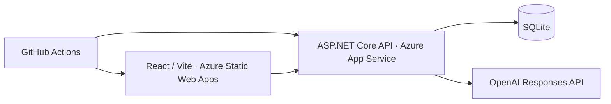

# Bönbot AI ❤️

**A personal Swedish AI study assistant.** Built as a private personal project, Bönbot pairs a warm, polished chat interface with document-based study tools.

[Live frontend](https://nice-sky-082471d03.3.azurestaticapps.net) · [Backend](https://bonbot-kevin.azurewebsites.net)

## Features

- **Personal access:** PIN-based login, bearer session tokens held in memory for 8 hours, and logout.
- **Swedish conversation:** AI chat with persistent SQLite history and a clear-chat action.
- **Study shortcuts:** Summarize, Quiz, Explain simpler, Flashcards, and Review quiz. Actions send immediately, with an optional attachment.
- **Readable answers:** Dedicated flashcard blocks, clearer quiz/list spacing, and preserved assistant line breaks.
- **Study files:** One PDF, TXT, or DOCX per message, up to **10 MB**. Text is extracted in memory; up to **40,000 characters** are sent to OpenAI as study material. History stores the message, filename, and reply—not the full extracted document text.
- **Polished interface:** Premium responsive design, warm glass surfaces, and dark/light themes.
- **Delivery:** Docker support, GitHub Actions CI/CD, and Azure hosting.

## Preview

### Login


### Chat


## Stack & architecture

| Layer | Technologies |
| --- | --- |
| Frontend | React, Vite, JavaScript, CSS |
| Backend | ASP.NET Core Minimal API, .NET 10 |
| Persistence | Entity Framework Core, SQLite |
| AI & documents | OpenAI Responses API, PdfPig; built-in .NET ZIP/XML for DOCX |
| Deployment | Docker, GitHub Actions, Azure App Service, Azure Static Web Apps |



The frontend uses `/chat` for text and `/chat-with-file` for attachments. Both share one chat request allowance. GitHub Actions builds and deploys each application when its files change on `main`.

## Security & limits

- Secrets stay outside Git; production backend secrets use **Azure App Settings**, and deployment credentials use GitHub Actions secrets.
- Bearer session tokens expire after **8 hours**. Sessions and rate-limit counters are in memory and reset when the API restarts.
- Login brute-force protection allows **5 failed attempts per rolling hour**.
- `/chat` and `/chat-with-file` share **100 authenticated requests per rolling hour**, per API instance—not separate allowances per endpoint or user.
- Messages are limited to **2,000 characters**; uploads are validated for supported extensions, count, and size.
- Attached documents are treated as source material. Application instructions explicitly prohibit following document commands, role changes, or embedded prompts. This is prompt-injection hardening, not a guarantee of model behavior.
- Uploaded files are not saved to disk. DOCX extraction does not execute macros or embedded objects; XML DTDs and external resolution are disabled.

## Local development

Requires **.NET 10**, **Node.js 22.12+**, and an OpenAI API key with access to the configured model. Run commands from the repository root unless shown otherwise.

Copy the environment templates and fill in your own local configuration:

```bash
cp GirlfriendAi.Api/.env.example GirlfriendAi.Api/.env
cp GirlfriendAi.Web/.env.example GirlfriendAi.Web/.env
```

Set backend `FRONTEND_URL` to `http://localhost:5173` and frontend `VITE_API_URL` to `http://localhost:5015`. Keep credentials in the ignored backend `.env` file.

Start the backend in a Bash terminal (`dotnet run` does not load `.env` automatically):

```bash
cd GirlfriendAi.Api
set -a
source .env
set +a
dotnet run --launch-profile http
```

In another terminal, start the frontend:

```bash
cd GirlfriendAi.Web
npm ci
npm run dev
```

Open `http://localhost:5173`. SQLite migrations run when the API starts.

### Docker Compose

Configure `GirlfriendAi.Api/.env` as above, but set `FRONTEND_URL=http://localhost:3000`. From the repository root:

```bash
docker compose up --build
```

Frontend: `http://localhost:3000` · API: `http://localhost:8080`. Compose supplies the frontend API URL at build time. The current Compose setup has no SQLite volume, so recreating the API container can discard its chat history.

## Limitations

- Scanned PDFs without a text layer require OCR, which is not supported yet. Complex PDF layouts may extract imperfectly.
- DOCX extraction reads the standard document body; headers, footnotes, images, and formatting are not extracted. Decompressed document XML is limited to 20 MB.
- Large documents are truncated to the first 40,000 extracted characters.
- File contents are available only for the request containing the attachment. Reattach a file when a later question needs its source text; saved conversation history remains available.
