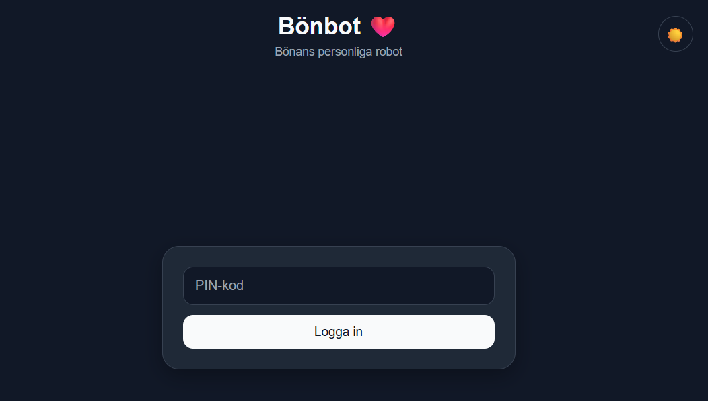
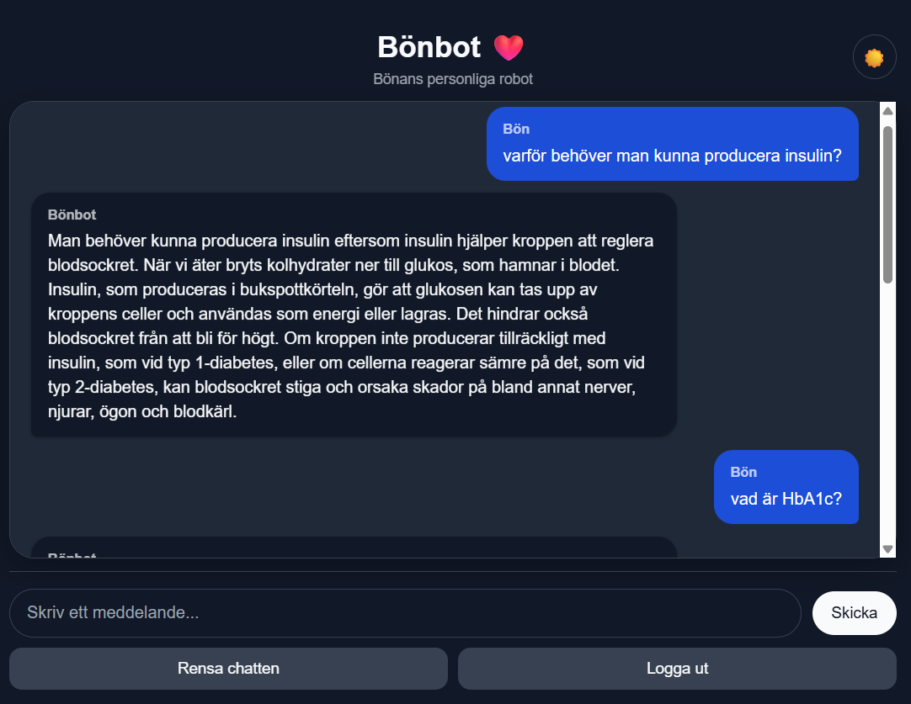

# ❤️ Bönbot AI

A small personal AI chat app built with **React**, **ASP.NET Core**, **SQLite**, **OpenAI**, and **Azure**.

Bönbot is a lightweight full-stack AI assistant with persistent chat history, PIN-based access, dark/light mode, and automatic deployment through GitHub Actions.

---

## ✨ Features

- 🔐 PIN login
- 💬 AI chat powered by OpenAI
- 🧠 Conversation context
- 💾 Persistent chat history
- 🗑️ Clear chat history
- 🌙 Light / Dark mode
- ☁️ Hosted on Azure
- 🔄 Automatic CI/CD with GitHub Actions
- 🔒 HTTPS-only backend

---

## 🖼️ Preview

### Login



### Chat



---

## 🛠️ Tech Stack

### Frontend
- React
- Vite
- JavaScript
- CSS
- Azure Static Web Apps

### Backend
- ASP.NET Core Minimal API
- .NET 10
- Entity Framework Core
- SQLite
- OpenAI Responses API
- Azure App Service

### DevOps
- Git
- GitHub Actions
- Azure CLI

---

## 🏗️ Architecture

```text
React / Vite
     │
     ▼
Azure Static Web Apps
     │
     ▼
ASP.NET Core API
     │
     ├── SQLite
     │
     └── OpenAI API